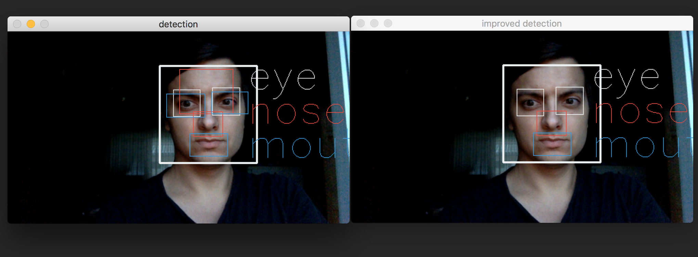

# How to open:
* Best way is to <b>run a Jupyter notebook</b> and open <b>violaJones.ipynb</b> – proper comments and descriptions can be found within this file. Even though github opens ipynb files, I strongly recomment to use Jupyter notebook, for the sake of proper visualisation.
* <b>violaJones.py</b> is capable of running without Jupyter, both for images and videos

